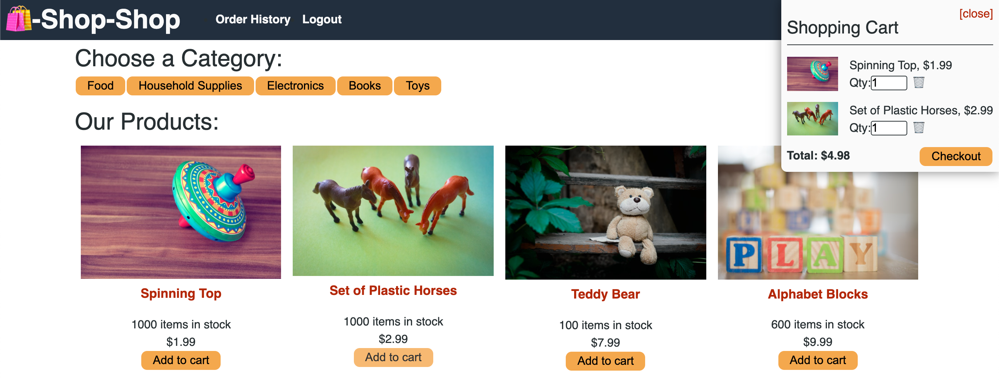

# redux-challenge
This week's challenge was to refactor code using the Global State to using Redux. 

## Description
This challenge tested the understanding of state and dispatch and the ability to read documentation from the Redux website in order to refactor this code. 

## Additional Information
### Notes
This was a difficult challenge up until you realized what to do then it went by quickly. Sifting through the information was definitely a challenge and trying to understand state and dispatch in order to wield the useDispatch and useSelector redux methods was challenging.

### Screenshot

### Access Application

* https://github.com/IsiBee/redux-challenge - Github Repo
* https://floating-castle-92569.herokuapp.com/ - Deployed App